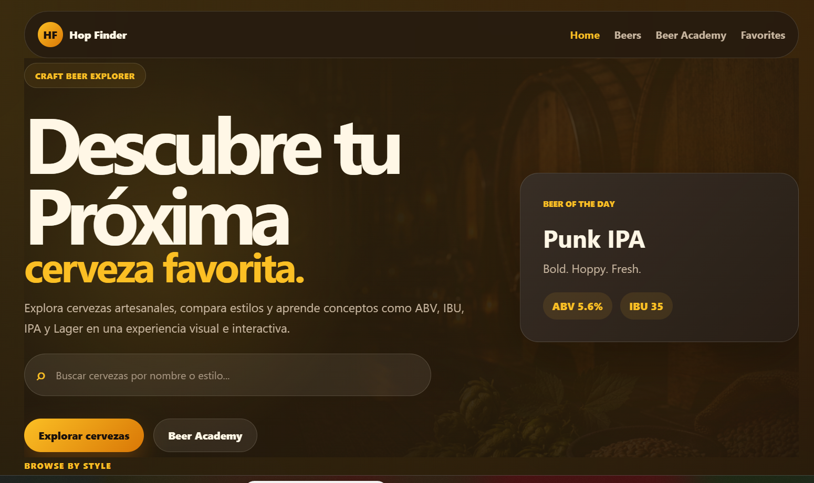
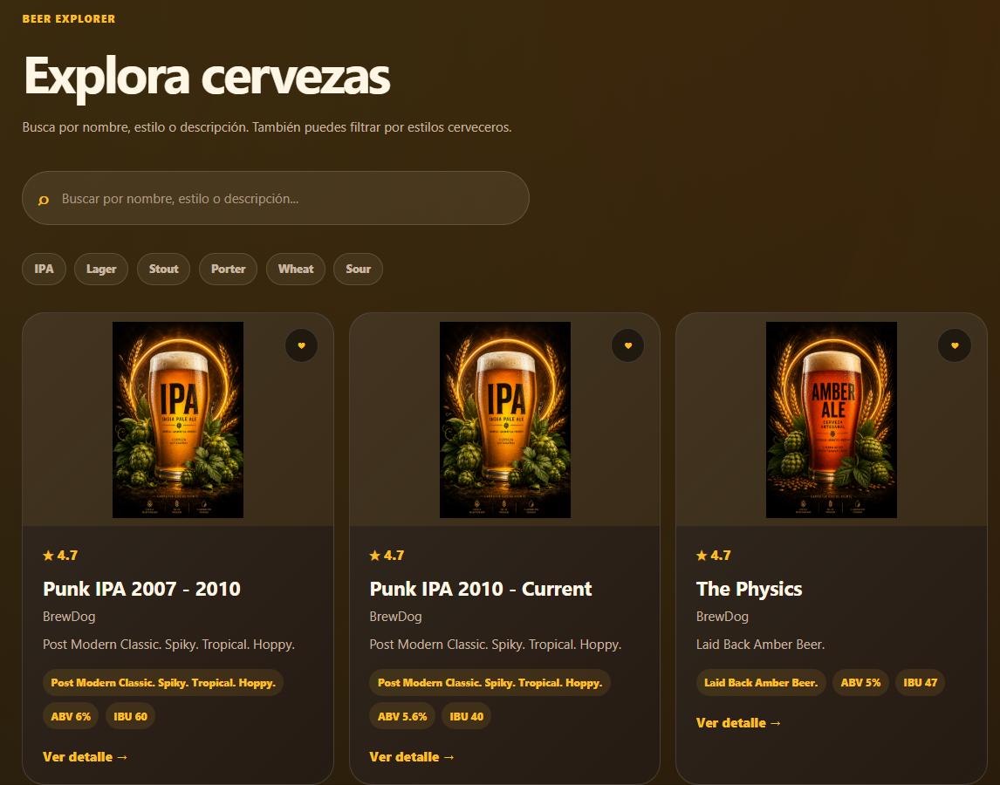
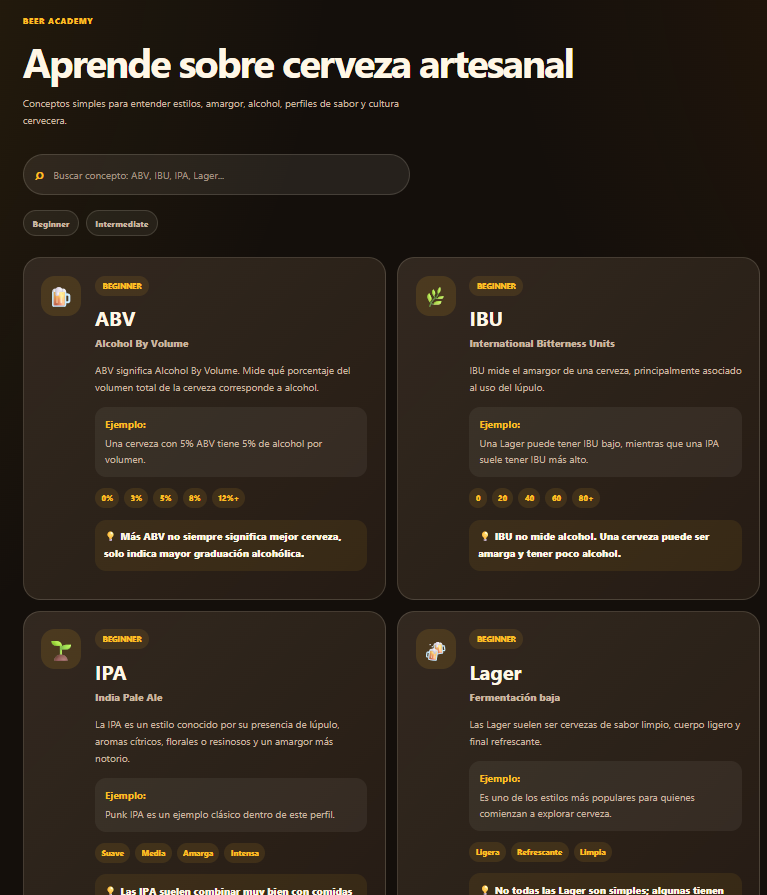

# 🍺 Hop Finder | Craft Beer Explorer

Aplicación SPA desarrollada con **Vue 3** que permite explorar cervezas artesanales, buscar por nombre o estilo, revisar información técnica como **ABV** e **IBU**, guardar favoritos y aprender conceptos cerveceros mediante una sección educativa llamada **Beer Academy**.

El proyecto incorpora consumo de API real, navegación con Vue Router, manejo de estado global con Pinia, favoritos persistentes en localStorage, búsqueda inteligente, filtros visuales, imágenes locales por estilo de cerveza y una interfaz premium inspirada en cervecerías artesanales.


---

## 📌 Índice

* [🍺 Descripción](#-descripción)
* [🔗 Repositorio](#-repositorio)
* [🌐 Demo](#-demo)
* [📸 Capturas](#-capturas)
* [🚀 Características](#-características)
* [🌎 Funcionalidades principales](#-funcionalidades-principales)
* [🧠 Beer Academy](#-beer-academy)
* [🔌 API utilizada](#-api-utilizada)
* [🛠️ Tecnologías utilizadas](#️-tecnologías-utilizadas)
* [📁 Estructura del proyecto](#-estructura-del-proyecto)
* [⚙️ Instalación y ejecución](#️-instalación-y-ejecución)
* [📱 Diseño responsive](#-diseño-responsive)
* [⚠️ Consumo responsable](#️-consumo-responsable)
* [📌 Estado del proyecto](#-estado-del-proyecto)
* [👩‍💻 Autora](#-autora)

---

## 🍺 Descripción

**Hop Finder** es una aplicación web desarrollada como proyecto de portafolio Front-End. Su objetivo es ofrecer una experiencia visual e interactiva para descubrir cervezas artesanales, explorar estilos, revisar detalles técnicos y aprender conceptos básicos del mundo cervecero.

La aplicación no funciona solo como un catálogo, sino también como una pequeña plataforma educativa gracias a la sección **Beer Academy**, donde se explican términos como **ABV**, **IBU**, **IPA**, **Lager**, **Stout**, **Porter**, **Wheat Beer** y **Sour Beer**.

El diseño fue trabajado con una estética oscura, cálida y premium, utilizando tonos ámbar, dorado, café oscuro y crema, junto con imágenes locales para reforzar la identidad visual del proyecto.

---

## 🔗 Repositorio

https://github.com/Paula-front/hop-finder

---

## 🌐 Demo

https://hop-finder-1.vercel.app/

---

## 📸 Capturas

### Página principal



### Detalle de cerveza



### Beer Academy



---

## 🚀 Características

* Aplicación SPA desarrollada con Vue 3.
* Navegación entre vistas mediante Vue Router.
* Manejo de estado global con Pinia.
* Consumo de API real mediante Axios.
* Buscador inteligente de cervezas.
* Sugerencias de búsqueda en tiempo real.
* Filtros visuales por estilo cervecero.
* Vista de detalle para cada cerveza.
* Sección **Beer of the Day** con cerveza aleatoria.
* Sistema de favoritos persistente con localStorage.
* Contador de favoritos en la barra de navegación.
* Beer Academy con contenido educativo.
* Modal inicial de consumo responsable.
* Imágenes locales por estilo de cerveza.
* Fondo visual personalizado en el Hero.
* Diseño responsive para escritorio, tablet y móvil.
* Arquitectura basada en componentes reutilizables.

---

## 🌎 Funcionalidades principales

### Buscador de cervezas

La aplicación permite buscar cervezas por:

* nombre;
* estilo;
* descripción;
* información asociada desde la API.

Además, el buscador muestra sugerencias dinámicas para acceder rápidamente al detalle de una cerveza.

---

### Filtros por estilo

Hop Finder permite filtrar cervezas por estilos como:

* IPA;
* Lager;
* Stout;
* Porter;
* Wheat;
* Sour.

Estos filtros están implementados como chips visuales, manteniendo una experiencia más moderna que un selector tradicional.

---

### Listado de cervezas

La vista de exploración muestra tarjetas con información principal de cada cerveza:

* nombre;
* cervecería;
* estilo;
* tagline;
* ABV;
* IBU;
* valoración visual;
* imagen local asociada al estilo;
* acceso al detalle;
* botón de favoritos.

---

### Detalle de cerveza

Cada cerveza cuenta con una vista individual donde se muestra información más completa:

* nombre;
* descripción;
* estilo;
* ABV;
* IBU;
* año de primera elaboración;
* maridaje recomendado;
* tips del maestro cervecero;
* imagen local representativa.

---

### Beer of the Day

La página principal incluye una sección llamada **Beer of the Day**, que muestra una cerveza aleatoria desde la API.

Esta sección fue diseñada como un bloque protagonista dentro de la Home, con imagen destacada, descripción, métricas principales y acceso al detalle.

---

### Favoritos

Los usuarios pueden guardar cervezas como favoritas.

La funcionalidad incluye:

* botón de favorito en cada tarjeta;
* persistencia mediante localStorage;
* contador de favoritos en el Navbar;
* vista dedicada para revisar cervezas guardadas;
* opción de quitar favoritos.

---

### Imágenes locales

Debido a que algunas imágenes externas de la API pueden no estar disponibles, Hop Finder implementa un sistema local de imágenes.

Las cervezas se asocian automáticamente a una imagen según su estilo o descripción:

* IPA;
* Lager;
* Stout;
* Porter;
* Wheat Beer;
* Sour Ale;
* Amber Ale;
* Pale Ale;
* Craft Beer;
* Rum Aged Imperial Porter.

Esto evita imágenes rotas y permite mantener una identidad visual consistente.

---

## 🧠 Beer Academy

**Beer Academy** es una sección educativa integrada en la aplicación.

Su objetivo es explicar conceptos cerveceros de forma simple, visual e interactiva.

Incluye conceptos como:

* **ABV**: Alcohol By Volume.
* **IBU**: International Bitterness Units.
* **IPA**: India Pale Ale.
* **Lager**.
* **Stout**.
* **Porter**.
* **Wheat Beer**.
* **Sour Beer**.

Cada concepto incluye:

* icono representativo;
* nivel de dificultad;
* subtítulo;
* descripción;
* ejemplo;
* escala visual;
* tip educativo.

También cuenta con búsqueda interna y filtros por nivel.

---

## 🔌 API utilizada

La aplicación consume datos desde una versión comunitaria de **PunkAPI v3**, utilizada para obtener información de cervezas artesanales.

La API entrega datos como:

* nombre de la cerveza;
* descripción;
* tagline;
* ABV;
* IBU;
* maridajes;
* tips del maestro cervecero;
* ingredientes;
* cerveza aleatoria.

La comunicación con la API está separada en una capa de servicios:

```bash
src/services/beerService.js
```

De esta manera, los componentes visuales no realizan llamadas directas a la API.

---

## 🛠️ Tecnologías utilizadas

* Vue 3
* Vite
* Vue Router
* Pinia
* Axios
* JavaScript
* CSS3
* LocalStorage
* PunkAPI v3 Community
* Vercel

---

## 📁 Estructura del proyecto

```bash
src/
├── assets/
│   ├── fonts/
│   ├── icons/
│   ├── images/
│   │   ├── backgrounds/
│   │   ├── beers/
│   │   └── logo/
│   └── styles/
│
├── components/
│   ├── academy/
│   │   ├── AcademyCard.vue
│   │   └── AcademyDetailCard.vue
│   │
│   ├── beer/
│   │   ├── BeerCard.vue
│   │   └── StyleCard.vue
│   │
│   ├── home/
│   │   ├── AcademyPreview.vue
│   │   ├── BeerOfTheDay.vue
│   │   ├── DidYouKnow.vue
│   │   ├── FeaturedSection.vue
│   │   ├── HeroSection.vue
│   │   └── StyleSection.vue
│   │
│   ├── layout/
│   │   ├── Footer.vue
│   │   └── Navbar.vue
│   │
│   └── ui/
│       ├── ResponsibleModal.vue
│       ├── SearchBar.vue
│       └── SectionTitle.vue
│
├── data/
│   ├── academyTopics.js
│   ├── beerFacts.js
│   ├── beerStyles.js
│   └── featuredBeers.js
│
├── router/
│   └── index.js
│
├── services/
│   └── beerService.js
│
├── stores/
│   └── beerStore.js
│
├── utils/
│   └── beerImage.js
│
├── views/
│   ├── BeerDetailView.vue
│   ├── BeersView.vue
│   ├── FavoritesView.vue
│   ├── GlossaryView.vue
│   └── HomeView.vue
│
├── App.vue
└── main.js
```

---

## ⚙️ Instalación y ejecución

Clonar el repositorio:

```bash
git clone https://github.com/Paula-front/hop-finder.git
```

Ingresar al proyecto:

```bash
cd hop-finder
```

Instalar dependencias:

```bash
npm install
```

Ejecutar el proyecto en modo desarrollo:

```bash
npm run dev
```

La aplicación estará disponible en:

```text
http://localhost:5173
```

Generar versión de producción:

```bash
npm run build
```

---

## 📱 Diseño responsive

La interfaz fue adaptada para distintos tamaños de pantalla:

* escritorio;
* tablets;
* dispositivos móviles.

El diseño mantiene tarjetas flexibles, grids responsivos y navegación adaptable para conservar una buena experiencia visual en diferentes dispositivos.

---

## ⚠️ Consumo responsable

Hop Finder es una aplicación desarrollada con fines educativos y de demostración tecnológica.

El proyecto no promueve el consumo excesivo de alcohol.

> El consumo de alcohol en menores de 18 años se encuentra prohibido en Chile.

La aplicación incluye un modal inicial de consumo responsable para reforzar este mensaje desde el primer acceso.

---

## 📌 Estado del proyecto

Proyecto finalizado como aplicación de portafolio Front-End.

Incluye consumo de API real, estado global con Pinia, navegación con Vue Router, favoritos persistentes, búsqueda inteligente, filtros, detalle de cerveza, Beer Academy, diseño responsive e identidad visual personalizada.

Mejoras futuras consideradas:

* Beer Quiz interactivo.
* Comparador de cervezas.
* Filtros avanzados por ABV e IBU.
* Modo claro/oscuro.
* Más conceptos educativos en Beer Academy.

---

## 👩‍💻 Autora

**Paula Pérez Valenzuela**

Desarrolladora Front-End Trainee.

GitHub: [Paula-front](https://github.com/Paula-front)

Proyecto desarrollado como parte del Bootcamp Front-End Trainee.
